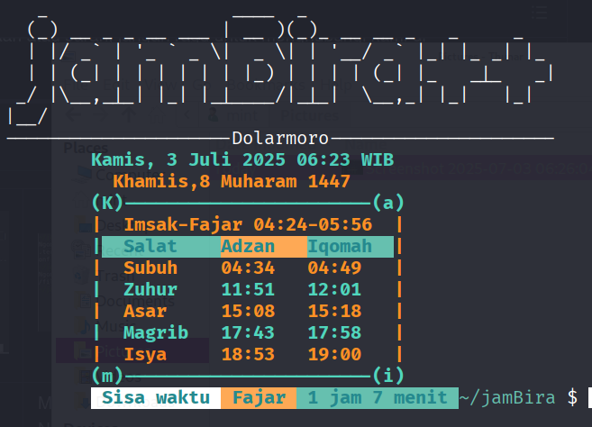
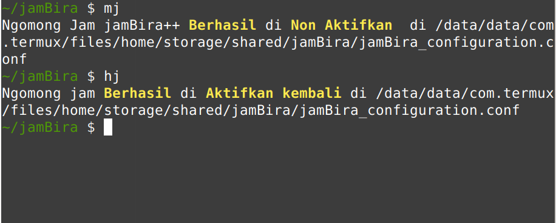

# 🌙 JamBira++: Teman Setia dalam Menyambut Waktu Shalat

---

## Tentang jamBira++

Apakah Anda sering kali melewatkan waktu **shalat atau sahur** di tengah 
kesibukan sehari-hari? Kini, hadir solusi cerdas yang akan mengingatkan Anda 
dengan cara yang unik dan menyenangkan! Perkenalkan, **jamBira++** – aplikasi 
notifikasi adzan yang bukan hanya sekadar pengingat, tetapi juga pengalaman 
audio yang menyentuh hati. 🎶

## 🎉 Rasakan Keajaiban Suara yang Menyentuh

Bayangkan, sebelum sahur, Anda disambut oleh suara ayam berkukuruyuk atau 
gemericik air terjun yang menenangkan. Dengan **jamBira++**, Anda dapat 
menyesuaikan notifikasi sesuai selera, menjadikan setiap momen lebih bermakna. 
Meskipun banyak aplikasi adzan di luar sana, jamBira++ menawarkan pendekatan 
yang berbeda dengan antarmuka berbasis teks yang sederhana namun efektif.

## 🙏 Pengalaman Spiritual yang Mendalam

Dapatkan pengalaman spiritual yang lebih mendalam dengan notifikasi yang 
berbicara langsung kepada Anda. Bayangkan, saat waktu shalat tiba, aplikasi ini 
memberi tahu Anda dengan sentuhan personal: **"Selamat Pagi, Bos Endro!** 
**Alkhamdulillah, sisa waktu Duha masih 1 jam, dan ditambah 34 menit lagi."** 
Siap untuk menjadikan setiap panggilan shalat sebagai momen yang tak 
terlupakan? Bergabunglah dengan kami dan rasakan keajaiban jamBira++!

## 🌟 Fitur Unggulan jamBira++

- **Notifikasi Suara yang Menyentuh** 🎤 
  Dapatkan notifikasi teks yang diperdengarkan dalam bentuk suara menjelang 
  **sahur, sebelum adzan, saat adzan, saat iqomah dan ngabuburit**. Suara 
  lembut dan menenangkan akan mengingatkan Anda untuk tidak melewatkan waktu 
  shalat.

- **Kustomisasi Audio** 🎵 
  Sesuaikan pengalaman mendengarkan Anda dengan memilih audio yang sesuai. 
  Apakah Anda ingin mendengar suara **ayam berkukuruyuk, jangkrik berderik,** **atau gemericik air terjun?** Semua bisa Anda atur sesuai selera!

- **Pesan Interaktif** 💬  
  Bayangkan, aplikasi ini bisa berbicara kepada Anda! "Selamat Pagi, Bos! 
  Alkhamdulillah, sisa waktu Duha masih 1 jam, dan ditambah 34 menit lagi." 
  Dengan jamBira++, setiap panggilan shalat menjadi lebih personal dan menyentuh.

- **Antarmuka Sederhana** 🖥️  
  Meskipun banyak aplikasi adzan dengan tampilan grafis yang menarik, jamBira++ 
  menggunakan Command Line Interface (CLI) yang efisien. Ini memungkinkan Anda 
  untuk mengeksekusi dan mengkonfigurasi aplikasi dengan mudah melalui text 
  editor di Android.

- **Integrasi dengan Termux** 📱  
  Untuk menjalankan jamBira++ dengan lancar, Anda memerlukan Termux sebagai 
  lingkungan operasinya. Dengan pengaturan yang sederhana, Anda dapat mengakses 
  direktori konfigurasi dan menyesuaikan aplikasi sesuai kebutuhan.

## 🔧 Fitur Lengkap jamBira++

- **Koreksi Volume** 🔊: Sesuaikan tingkat suara notifikasi sesuai kenyamanan 
    Anda.
- **Bahasa yang Beragam** 🌍: Aplikasi ini dapat berbicara dalam bahasa Jawa, 
    Sunda, dan Indonesia.
- **Koreksi Waktu Shalat** ⏰: Atur waktu fajar, adzan shubuh, hingga isya   
    dengan akurat.
- **Koreksi Waktu Iqomah** ⏰: Atur iqomah shubuh, hingga isya dengan akurat.
- **Notifikasi yang Fleksibel** 📅: Atur notifikasi 45 menit sebelum adzan, 
    dengan kelipatan 8 hingga 15 menit.
- **Pengaturan Audio** 🎧: Koreksi pemutaran audio sebelum waktu-waktu penting 
    seperti dukha, imsak, dan fajar.
- **GPS Akurat** 📍: Pastikan perhitungan waktu shalat Anda lebih tepat dengan 
    pengaturan GPS.

## 🚀 Cara Memulai

1. **Instal Termux**: Pastikan Anda telah menginstal Termux dan Termux:API di 
    perangkat Android Anda. Gunakan **F-Droid** untuk install **Termux:API**.
2. **Unduh jamBira++**: Clone repositori ini ke perangkat Android milik Anda di  
    direktori/data/data/com.termux/files/home.
3. **Ketikkan termux-setup-storage**: CLI Termux dan pilih Yes.
4. **Ketikkan ./installerJamBira**: Ada di direktori alatBantu. Perangkat 
    Android harus terkoneksi dengan jaringan internet.
5. **Ketikkan jb 4**: Membuat ngomong jam dan waktu salat saat ini.
6. **Ketikkan jb help**: Opsi yang lain setelah jb.
10. **File Konfigurasi jamBira++**: Ada di direktori :
    /data/data/com.termux/files/home/storage/shared/jamBira yaitu 
    jamBira_configuration.conf,jamBira_suaraDanteks.conf dan 
    jadwalShalat_configuration.conf gunakan text editor kesukaan Anda di Android.

## 🚀 Perintah Yang Sering Dijalankan di CLI

1. **mj**: Opsi menonaktifkan ngomong jam.
2. **hj**: Opsi mengaktifkan ngomong jam.
3. **ma**: Opsi menonaktifkan audio.

## 📄 Lisensi

Aplikasi ini dilisensikan di bawah [MIT License](LICENSE).

## Kadaluwarsa

Aplikasi jamBira++ berakhir hingga tanggal **[Expired](kadaluwarsa.txt)**, 
ingin lebih hubungi alamat email di bawah.

## 📞 Kontak

Jika Anda memiliki pertanyaan atau saran, jangan ragu untuk menghubungi kami di 
[duitmoro@yahoo.com](mailto:duitmoro@yahoo.com).

---

## 📁 Screenshoot

|  |  |  |
|--------------------------------------------------|--------------------------------------------------|--------------------------------------------------|
| Tampilan Utama                                      | Matikan dan Hidupkan Ngomong Jam                                      | Jadwal Lengkap                                      |

## 📜 Last But Not List

JamBira++ bukan hanya sekadar aplikasi, tetapi sebuah pengalaman spiritual yang 
akan mengingatkan Anda untuk selalu dekat dengan Sang Pencipta. Dengan 
fitur-fitur unik dan kemampuan kustomisasi yang tinggi, jamBira++ siap menjadi 
teman setia Anda dalam menjalani ibadah sehari-hari. Jangan lewatkan kesempatan 
untuk menjadikan setiap panggilan shalat sebagai momen yang penuh makna. 
**Unduh jamBira++ sekarang dan rasakan perbedaannya!** 🌟
